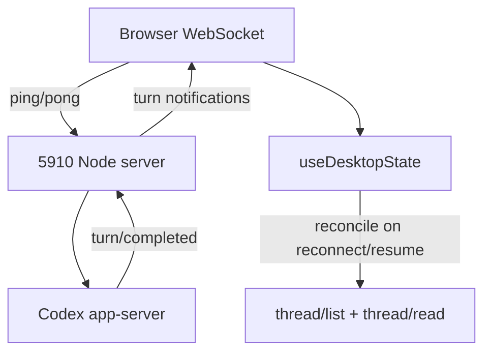

# Realtime reconnect recovery

## Scope

This change covers intermittent 5910 sessions where the app-server completes a turn but the browser does not render the answer until a full page refresh.

## Confirmed design

- The server sends WebSocket protocol heartbeats and terminates stale connections.
- The client refreshes the selected thread and thread list after every notification-stream reconnect.
- The client exposes a lightweight realtime reconciliation entry point for focus, visibility, and network-resume events.
- A full page reload is not used as the recovery mechanism, so composer drafts and local UI state remain intact.

## Flow

## Acceptance matrix

| ID | Requirement | Contract test | Acceptance |
|---|---|---|---|
| RR-001 | A reconnect must reconcile an already-loaded selected thread | `useDesktopState.test.ts` reconnect recovery case | A missed completion becomes visible without a full page reload |
| RR-002 | Reconnect recovery must refresh the thread list as well as the selected thread | `useDesktopState.test.ts` reconnect recovery case | New title/status/in-progress state is reflected |
| RR-003 | Focus/visibility/network resume must have a lightweight reconciliation entry point | `useDesktopState.test.ts` realtime reconciliation case | Current thread is refreshed without reloading the page |
| RR-004 | WebSocket stale connections must be detected server-side | `httpServer.websocket.test.ts` heartbeat case | A connection that does not pong is terminated and a healthy connection remains |

## Non-goals

- No changes to the 5900 production service.
- No new runtime dependency.
- No automatic duplicate submission of a turn.
- No full-page reload on transport recovery.

## Failure behavior

A failed reconciliation remains transient and is retried by the existing event-sync scheduling. The server heartbeat only affects the notification transport; it does not interrupt the Codex turn itself.

## Naming

| Object | Candidate names | Recommendation |
|---|---|---|
| Reconcile active realtime state | `syncRealtimeState`, `reconcileRealtimeState`, `refreshAfterResume` | `reconcileRealtimeState`: describes a state read-back, not a transport-specific retry |
| WebSocket liveness state | `isAlive`, `heartbeatState`, `connectionHealth` | `isAlive`: matches the `ws` heartbeat convention |

## Review status

Design confirmed by the user on 2026-09-18. Contract tests are frozen before production implementation.
