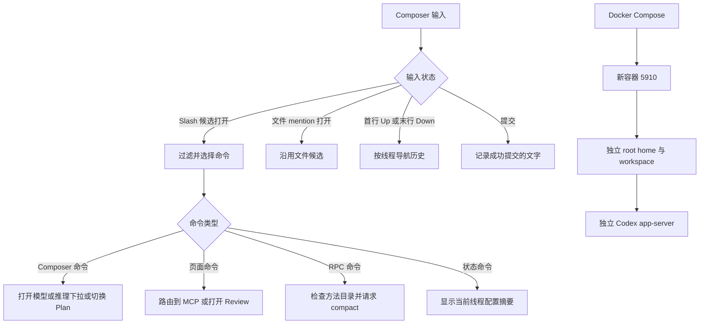

# Slash 命令、输入历史与 Docker 隔离部署设计

## 需求与验收

| ID | 需求 | 本期实现 | 验收方式 | 状态 |
|---|---|---|---|---|
| RQ-001 | Composer 支持 `/` 开头命令 | 输入 `/` 后显示可过滤候选，支持键盘、鼠标和触屏选择 | 纯逻辑单元测试与手工验证 | 设计已确认 |
| RQ-002 | 支持常用 Codex 命令 | `/model`、`/reasoning`、`/plan`、`/status`、`/mcp`、`/review`、`/compact` 映射到真实 UI 或 RPC | 命令分发测试与容器内手工验证 | 设计已确认 |
| RQ-003 | 上下方向键获取历史输入 | 按线程保存最近 50 条成功提交的文字；方向键导航并恢复进入历史前的草稿 | 纯逻辑单元测试与手工验证 | 设计已确认 |
| RQ-004 | 正式 Docker 支持 | 多阶段镜像、Compose、健康检查、配置示例 | Docker 构建及运行验证 | 设计已确认 |
| RQ-005 | 不影响现有生产实例 | 新容器、端口、根目录、`CODEX_HOME` 与工作目录全部独立 | 部署前后核对 5900 服务 PID 和响应 | 设计已确认 |

## 现有能力与复用

| 模块 | 已有能力 | 本次复用方式 | 为什么放在这里 |
|---|---|---|---|
| `ThreadComposer.vue` | 草稿、文件 mention、模型/推理选择、Plan 开关和键盘处理 | 接入 Slash 菜单和历史导航 | 输入状态及键盘优先级已经集中在这里 |
| `ComposerDropdown.vue` | 模型和推理强度自定义下拉框 | 暴露受控的打开方法 | 避免引入新的下拉组件或原生 `select` |
| `App.vue` | 路由、Review 面板、线程上下文 | 分发 `/mcp`、`/review` 和 `/compact` | 页面级动作应由顶层页面状态所有者执行 |
| `codexGateway.ts` | RPC、方法目录和 review 接口 | 增加带能力检查的 compact 调用 | 统一复用现有 RPC 错误处理 |
| Docker 快测脚本 | Node/Codex/CODEX_HOME 的容器运行先例 | 提炼为正式 Dockerfile 与 Compose | 不复制测试脚本中的无密码和临时挂载设置 |

## 范围

- 本期必做：七条命令、候选菜单、键盘/触屏交互、每线程输入历史、正式 Dockerfile、Compose、隔离部署说明和聚焦测试。
- 外部依赖：Node.js 22、Docker Engine/Compose、`@openai/codex`、连接端 app-server 的方法目录。
- 明确不做：`/goal`、`/memories`、共享生产 app-server、共享生产 `CODEX_HOME`、迁移生产历史会话、修改生产 5900 服务。
- 降级行为：未知 Slash 命令按普通文本发送；`thread/compact/start` 不可用时显示英文错误，不发送伪造消息。
- 依赖策略：不新增 npm 依赖，不在仓库生成新的依赖锁文件。

## 完整调用流程

## 组件职责

| 组件 | 职责 | 状态所有权 | 失败归属 |
|---|---|---|---|
| `threadComposerInputUtils.ts` | Slash 触发/过滤/高亮和历史导航纯逻辑 | 无持久状态 | 返回无匹配或不可导航 |
| `SlashCommandMenu.vue` | 候选展示和指针选择 | 高亮索引由 Composer 管理 | 不执行命令 |
| `ThreadComposer.vue` | 维护候选、历史游标、草稿快照及键盘优先级 | 当前线程 Composer | 显示用户可见的英文提示 |
| `App.vue` | 执行路由和页面级命令 | 当前路由/Review 状态 | 捕获 RPC 或路由错误 |
| `codexGateway.ts` | 封装 compact RPC | 无 UI 状态 | 抛出规范化英文错误 |
| Docker/Compose | 构建并运行隔离实例 | `/opt/codexapp-fork` | 健康检查失败时容器 unhealthy |

## 状态与数据流

- Slash 候选只在光标前内容满足 `^\s*/[^\s/]*$` 时打开，避免把路径中的 `/` 当作命令。
- 键盘优先级：文件 mention > Slash 菜单 > 输入历史 > 发送。
- 历史记录按 `activeThreadId` 写入 `localStorage`，最多 50 条，忽略空文本和连续重复文本。
- 第一次按 `ArrowUp` 时保存当前草稿；`ArrowDown` 越过最新历史时恢复该草稿。
- 多行输入仅在光标位于首行时响应 `ArrowUp`，位于末行时响应 `ArrowDown`；存在选区或修饰键时不拦截。
- 切换线程会保存当前草稿、关闭候选并加载目标线程的历史。

## 幂等、并发与失败处理

- 连续提交同一文字只保留一条相邻记录。
- Slash 选择先关闭候选再执行，避免 Enter 同时触发普通发送。
- 异步命令以当前线程 ID 快照执行；线程为空时拒绝 review/compact。
- compact 先检查方法目录；不支持或 RPC 失败时只显示错误，不改变会话状态。
- Docker 使用固定容器名和独立路径，重复 `compose up -d` 更新同一测试实例，不创建无界容器。
- Compose 的密码只从未纳入 Git 的 `deploy/codexapp-fork.env` 读取；示例文件不含真实凭证。
- Compose 通过 `CODEXAPP_SSH_DIR` 以只读方式挂载宿主机 SSH 目录到容器 `/root/.ssh`，供 Git SSH 验证使用；私钥不进入镜像。

## 测试矩阵

| ID | 契约 | 自动化测试 |
|---|---|---|
| TC-001 | 仅命令位置触发 Slash，路径不触发 | `threadComposerInputUtils.test.ts` |
| TC-002 | 候选按名称和描述过滤，高亮循环 | `threadComposerInputUtils.test.ts` |
| TC-003 | 历史写入去空、相邻去重并限制 50 条 | `threadComposerInputUtils.test.ts` |
| TC-004 | Up/Down 访问历史并恢复草稿 | `threadComposerInputUtils.test.ts` |
| TC-005 | 多行边界、选区和修饰键不误触历史 | `threadComposerInputUtils.test.ts` |
| TC-006 | Docker 默认使用 5910、独立挂载且不关闭认证 | `dockerRuntime.test.ts` |
| TC-007 | 构建产物能启动 CLI、HTTP 和 app-server | Docker smoke test |
| TC-008 | 生产 5900 在新容器部署前后不变 | 远端只读核验 |
| TC-009 | 每线程历史键名和损坏存储降级语义稳定 | `threadComposerInputUtils.test.ts` |
| TC-010 | compact 使用真实 `thread/compact/start` RPC 契约 | `codexGateway.test.ts` |

组件级鼠标/触屏操作、Vue 路由切换、`localStorage` 与真实浏览器生命周期接线标记为自动化 `N/A`：仓库当前没有 Vue 组件测试依赖，且本期不新增依赖；这些行为由上述纯逻辑测试、现有类型检查以及 `tests/chat-composer-rendering/slash-commands-and-input-history.md` 的容器内手工验收共同覆盖。

## 命名

| 对象 | 采用名称 | 中文含义 | 取舍 |
|---|---|---|---|
| Slash 注册表 | `SLASH_COMMANDS` | 可用命令清单 | 简单直接，便于纯逻辑测试 |
| Slash 触发识别 | `resolveSlashCommandTrigger` | 识别光标处命令查询 | 明确返回查询和替换区间 |
| 输入历史状态 | `ComposerInputHistoryState` | 历史游标和草稿快照 | 与 Vue 状态解耦，便于测试 |
| 候选菜单 | `SlashCommandMenu` | Slash 命令候选菜单 | 与现有 Composer 组件命名一致 |
